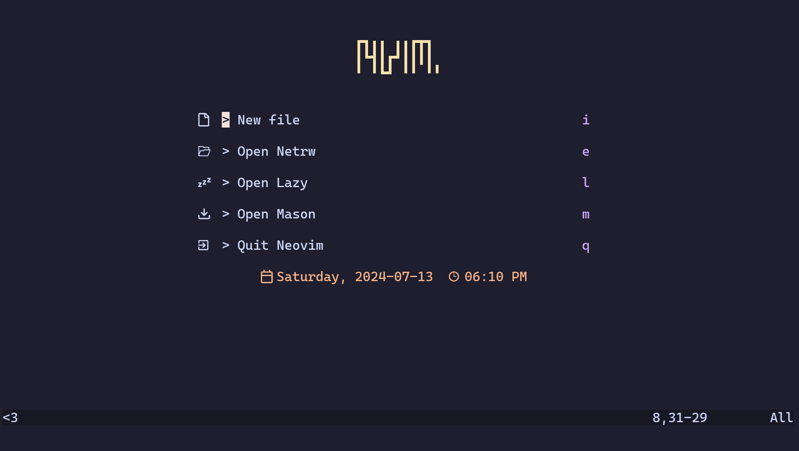

# nvim-config

My personal Neovim config.

This config is built from scratch for the sake of education and control;
and comes with no guarantees of functionality or stability.
If you do not know exactly why you like this config, you are probably better off with an alternative.
Notably, [LazyVim](https://github.com/LazyVim/LazyVim) for a ready-made setup
or [kickstart.nvim](https://github.com/nvim-lua/kickstart.nvim/) for a build-your-own config.

## Notable plugins

- Plugin installation with [lazy.nvim](https://github.com/folke/lazy.nvim)
- LSP installation with [mason.nvim](https://github.com/williamboman/mason.nvim)
- Code screenshots with [nvim-silicon](https://github.com/michaelrommel/nvim-silicon)
- Java LSP configuration with [nvim-jdtls](https://github.com/mfussenegger/nvim-jdtls)
- Rust LSP configuration with [rustaceanvim](https://github.com/mrcjkb/rustaceanvim)
- Spelling and grammar checking with [Harper](https://writewithharper.com/)
- Live markdown preview rendering with [markdown-preview.nvim](https://github.com/iamcco/markdown-preview.nvim)
- Startup screen with [alpha](https://github.com/goolord/alpha-nvim)
  - Has four possible header artworks,
    see [`lua/config/alpha.lua`](./lua/config/alpha.lua) for more details



## Installation

### Requirements

- [Silicon](https://github.com/Aloxaf/silicon)
  - [Caskaydia Cove](https://github.com/eliheuer/caskaydia-cove)
  - [Noto Color Emoji](https://github.com/googlefonts/noto-emoji)
- [CMake](https://cmake.org/)
  - [`g++`](https://gcc.gnu.org/) or [`clang++`](https://clang.llvm.org/)
    (configurable, see [`ftplugin/cpp.lua`](./ftplugin/cpp.lua))
  - [Ninja](https://ninja-build.org/) (configurable, see [`ftplugin/cpp.lua`](./ftplugin/cpp.lua))
- [Node.js](https://nodejs.org/en)
  - [npm](https://www.npmjs.com/)
  - This config is built and used with node.js v20.12.2
    (installed through [`nvm install --lts`](https://github.com/nvm-sh/nvm)),
    but older or newer versions would likely work fine
- [Rust](https://www.rust-lang.org/) toolchain
  - Cargo
  - `rustc`
  - [rust-analyzer](https://rust-analyzer.github.io/)
    - Could also be installed with [mason.nvim](https://github.com/williamboman/mason.nvim),
      and there is a commented out line in [`init.lua`](./init.lua) to do so,
      but installing as a part of your toolchain (`rustup compent add rust-analyzer`)
      helps to [avoid version inconsistencies](https://github.com/mrcjkb/rustaceanvim/blob/master/doc/mason.txt)
- A Java Development Kit
  - This project is built and developed on [OpenJDK](https://openjdk.org/) 21,
    but older or newer versions would likely work fine
  - Specifically, this project is built and developed
    on [`openjdk-21-jdk`](https://packages.ubuntu.com/noble/openjdk-21-jdk) from the Ubuntu 24.04 repositories
  - This project is not tested on Windows,
    but [Eclipse Temurin](https://adoptium.net/) is my go-to OpenJDK distribution on Windows
- [Go](https://go.dev/) toolchain
  - [sqls](https://github.com/sqls-server/sqls)
    currently [needs Go >= 1.21](https://github.com/sqls-server/sqls/blob/efe7f66d16e9479e242d3876c2a4a878ee190568/go.mod#L3)
- Python 3, including virtual environments
  - Not sure what minor version exactly,
    but what the Ubuntu 24.04 packages `python3` and `python3-venv` provide something new enough.
- [Ripgrep](https://github.com/burntsushi/ripgrep)
- A POSIX-compatible shell (provides `sh`), Bash, Git, curl, GNU Wget, GNU tar, gzip, and unzip
- Neovim 0.12.0
  - As of Telescope commit `85922dd`,
    Neovim [must be compiled with LuaJIT](https://github.com/nvim-telescope/telescope.nvim/blob/85922dd/README.md#getting-started)
  - This project is built and used on Neovim nightly on Ubuntu 24.04
    using [bob](https://github.com/MordechaiHadad/bob).
- [`fd`](https://github.com/sharkdp/fd),
  [`inotifywait`](https://github.com/inotify-tools/inotify-tools)
  (optional, but significantly improve performance)

### Manual installation

- Assumes `$XDG_CONFIG_HOME/nvim` does not already exist.
  If it does, remove it (preferably with a backup) before installation
  or override it with `$NVIM_APPNAME`.
- Assumes that you have installed the [requirements](#requirements).

```bash
mkdir ~/.config
git clone 'https://github.com/RemasteredArch/nvim-config.git' "${XDG_CONFIG_HOME:-$HOME/.config}/nvim"
```

### Automatic installation

- Designed for Ubuntu 24.04, but _might_ work on other versions or other `apt`-based distributions
- This is only lightly tested!
  You should probably read the source code before running it.

```bash
# Practice good hygiene, DO NOT RUN THIS if you are not certain that it is okay!
. <(curl -fsSL 'https://raw.githubusercontent.com/RemasteredArch/nvim-config/main/setup.sh')
```

## License

nvim-config is licensed under the GNU Affero General Public License version 3, or (at your option) any later version.
You should have received a copy of the GNU Affero General Public License along with nvim-config, found in [LICENSE](./LICENSE).
If not, see <https://www.gnu.org/licenses/>.

nvim-config contains code from other software.
See [`COPYING.md`](./COPYING.md) for more details.
